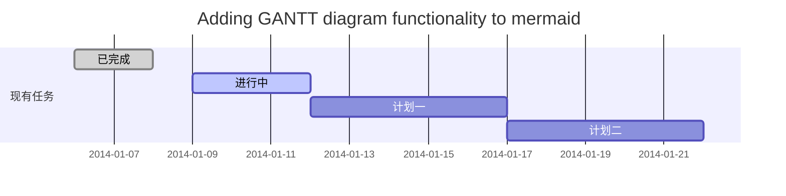

* [X]  任务未完成
*  [ ]  任务完成
# 学习markdown
## 加油

### 如何改变文本的样式

*一个星号变斜体*  _或者一个下双线_

**两个星星加粗文本** __2个下双横线加粗文本__

==两个等于标记文本==

~~两个这个波浪线删除文本~~

> 一个大于号引用文本，如图

==CO~2~is是二氧化碳==

==那个老国师居然想要这么多2^64^==

## 插入链接与图片

链接: [link](https://mp.csdn.net).

图片: 
 
## 创建一个表格
一个简单的表格是这么创建的：
时间   | 状态
-------- | -----
之前 | ==加油==
现在  | ==坚持==
未来  | ==坚持加油==

### 设定内容居中、居左、居右
使用`:---------:`居中
使用`:----------`居左
使用`----------:`居右
 时间   | 状态
--------: | :-----
之前 | ==加油==
现在  | ==坚持==
未来  | ==坚持加油==
**我会啦**

时间   | 状态
-------- | -----------
之前 | ==加油==
现在  | `坚持`    
未来  | ==坚持加油==
`嘻嘻`
## `创建一个自定义列表`
==可爱的学长==
:  太难啦任务

==Authors==
:  John
:  Luke
==**自定义列表就加一个冒号**==

## 如何创建一个注脚

一个具有注脚的文本。[^2]
我也做一个猪脚。[^2]

[^2]: 注脚的解释

##  注释也是必不可少的

Markdown将文本转换为 HTML。

*[HTML]:   超文本标记语言
## 新的甘特图功能，丰富你的文章

- 关于 **甘特图** 语法，参考 [这儿][5],

*好了*
* [X] *任务完成*
      
==对我来说安装java简直是爆裂的过程==
本来是按着教程来操作，可是教程中的java好像出了些什么问题
怎么搞得不行
后来向大佬取经后再加上掉发的威力最终完成（坤坤不敢说话，卑微小谭）
[link]()
## java环境配置：
- 在官网上面下载jdk
- 讲jdk存放在c盘里的Program Files里(==默认==)
- 打开我的电脑，点击属性，再找到环境变量，由于我将jdk装在c盘，所以在用户变量里添加变量名为JAVA_HOME，变量C:\ProgramFiles\Java\jdk1.8.0_231的路径
- 在path中添加%JAVA_HOME%\bin
- 打开cmd，输入java -version，检验是否安装成功
- 出现如下图就是完成了

## 虚拟机安装
-点击新建，给虚拟机赋予名字，接着选择类型，和版本
- 给虚拟机分配内存
- 使用以后虚拟硬盘文件，找到自己的ubuntu的文件的路径
- 最后点击创建就好了
下面是我的展示图
[link]()
我还没有装系统所以还打不开。
       
# `自我介绍`
## `谭宗福`
### ==学长学姐好==
*我来自湖南郴州，对着我们基地有着浓厚的兴趣。*
*平时的我，比较喜欢户外运动，打球什么的虽然菜，但是比较热爱。*
*不过最喜欢的还是学习，这可不是瞎说，我真的很喜欢学完后的成就感。
~~就像是失去神经，我感觉不到呼吸~~
这种成就感真的很好，虽然目前我可能不像学长学姐们一样优秀，但是我会一直努力。*
## `奥利给~奥奥奥力力给给给给` ##

~~html+css我真的有去学了，在网页中看了，去某站也白嫖了，可是我还是不怎么会啊，只懂一点点,所以我目前就只能用这样的方式进行自我介绍（手动难受 ）~~

==还有还有,这里补上一张java的图片，表示宝宝已经完成（出来点问题上面没得）==

##### 请不要放弃我，救救孩子吧

